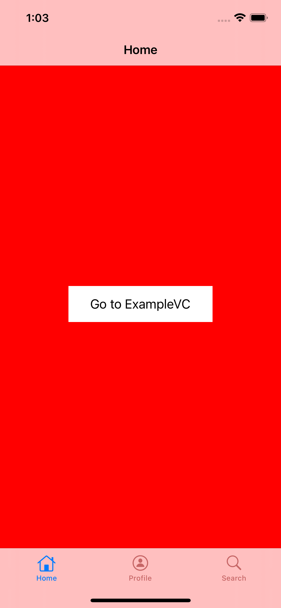
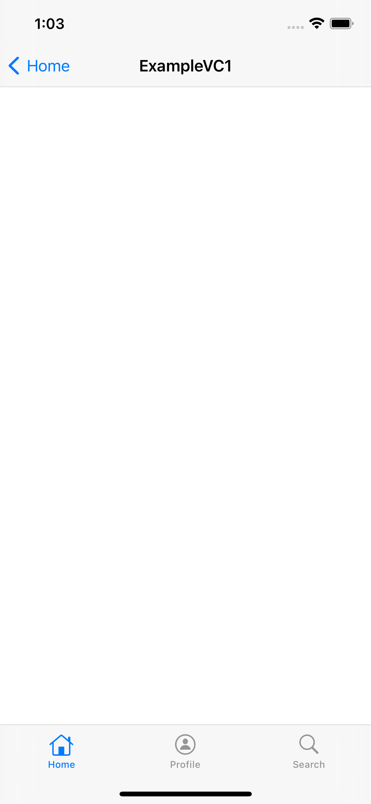
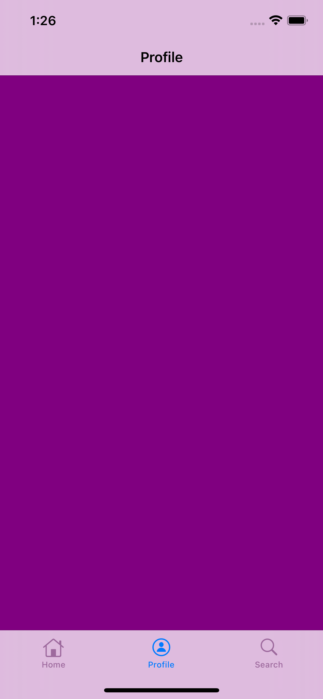
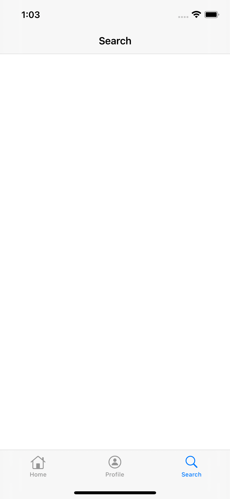

# CustomTabBarControllerProgrammaticly

- This is a simple example of a custom tab bar controller. 
- Every tab bar item has a navigation controller. 
- I find it more practical this way than making it with a storyboard. 
  - Especially if the view controller classes have initializer methods or if there is a need to use dependency injection techniques. 
  - I made an example of an initializer injection in the project.
  
          
   
